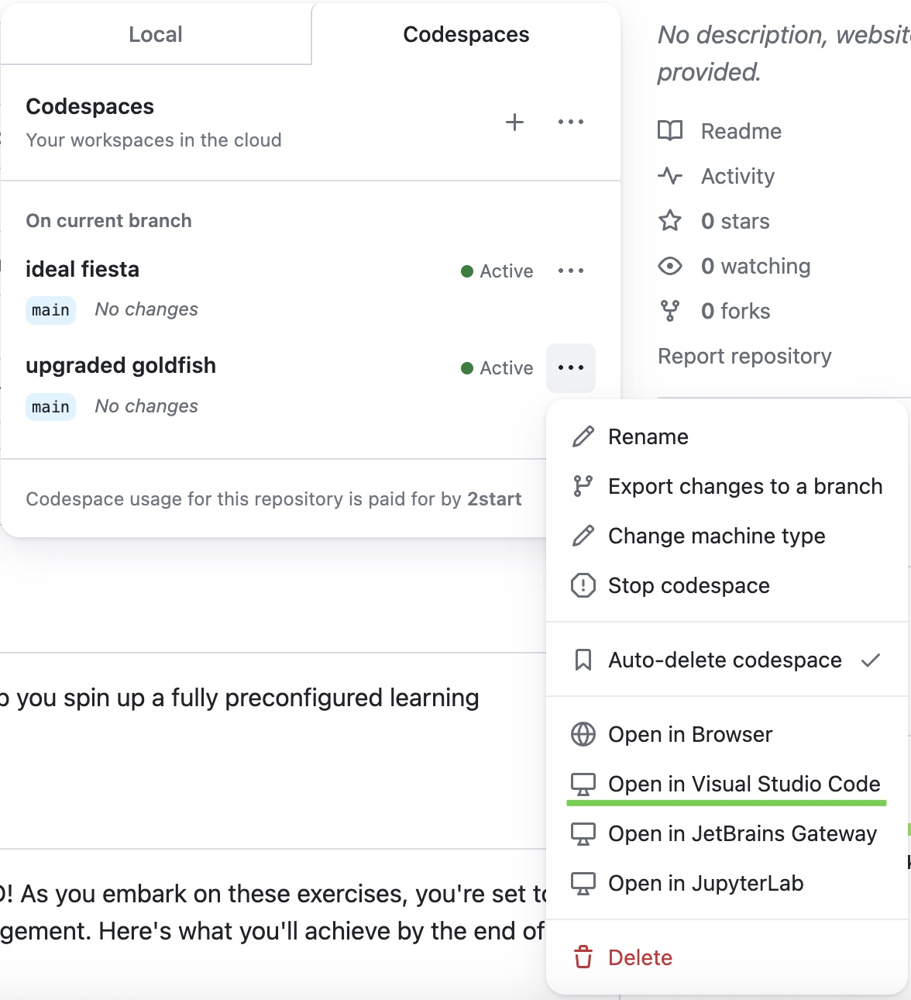
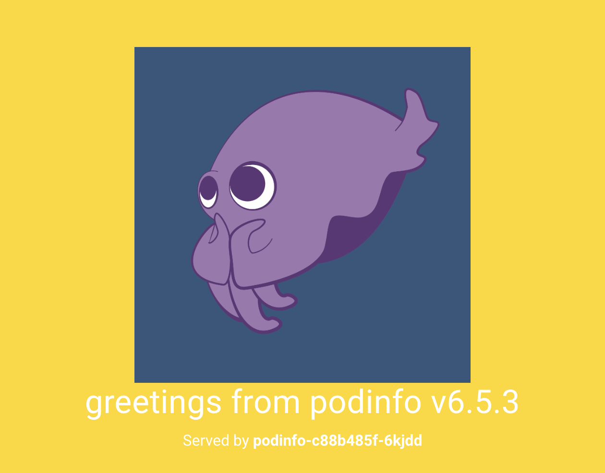
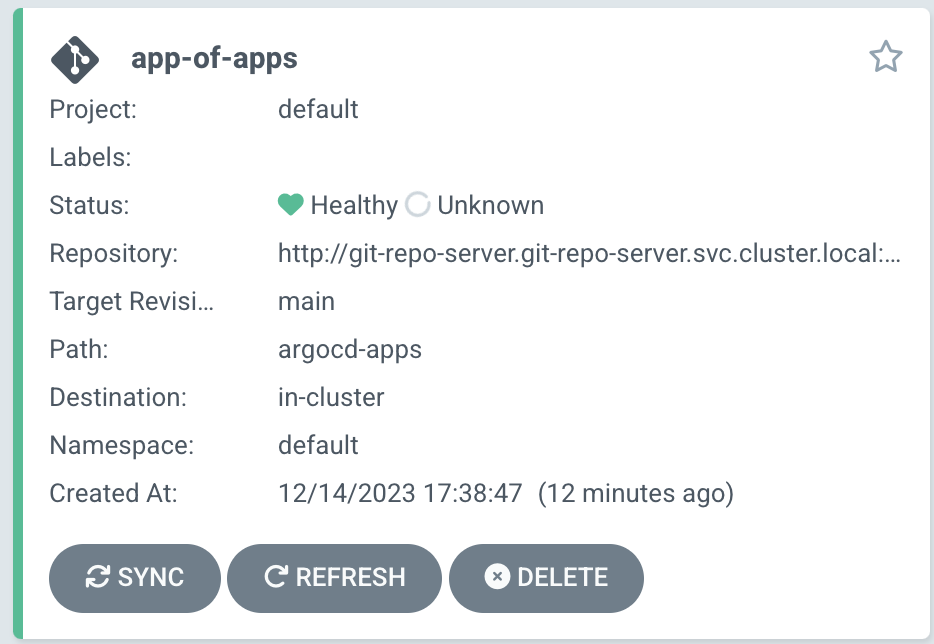

# Kutespace: GitOps with Argo CD

Welcome to Kutespace's GitOps with Argo CD repository! This guide will help you spin up a fully preconfigured learning environment with Kubernetes & Argo CD.

## What is GitOps & Argo CD?

Argo CD is a declarative, GitOps continuous delivery tool for Kubernetes. You can think of it as a tool that ensures the state of your Kubernetes cluster matches the configurations defined in a Git repository.

More information:
- [GitOps](https://about.gitlab.com/topics/gitops/)
- [Argo CD](https://argo-cd.readthedocs.io/en/stable/)

## Learning Outcomes

As you embark on these exercises, you're set to learn key practices in modern application deployment and management. Here's what you'll achieve by the end of this guide:

- **Implementing GitOps Workflow**: You'll use Git as the source of truth for your infrastructure, applying changes that automatically trigger deployments.
- **Using Argo CD Dashboard**: You'll learn to navigate the Argo CD dashboard, monitoring the status and health of your applications.
- **Deploying Your Own Application**: Before diving into more advanced concepts, you'll start by using provided templates to deploy an application of your choice, integrating it with the GitOps workflow.
- **Rolling Back Changes**: You'll exercise version control to revert deployments, appreciating the benefits of a Git-driven workflow.
- **Understanding Multi-Stage Deployments**: You'll explore how to manage multiple deployment environments using Argo CD, enhancing your understanding of real-world DevOps practices.

By the end of these exercises, you'll have a solid foundation in deploying and managing Kubernetes applications using Argo CD.

## Getting Started

To begin, launch a new Codespace directly from GitHub.


Once you started the Codespace it will open in a new browser window. Close that browser window and start the Codespace in VSCode instead.
Codespaces in the browser are not supported yet.



## Exercises

### Exercise 1: Verify the Kubernetes Setup

Start by ensuring you can interact with Kubernetes:

1. Request the nodes; you should see a single node returned:

```shell
kubectl get nodes
```

2. Check the pods across all namespaces. Look for services like Argo CD, a local git server, and a Traefik load balancer:

```shell
kubectl get pods --all-namespaces
```

Ensure the pod statuses are 'Completed' or 'Running'.

### Exercise 2: Access the Argo CD Dashboard

Access the Argo CD dashboard through your browser. The URL format is `http://argocd.127.0.0.1.nip.io:<FORWARDED K3D INGRESS PORT>`. The load balancer listens on port 8080, which is forwarded to your local machine. Locate your local machine's corresponding port by opening your VS Code terminal and switching to the `PORTS` tab. In the below picture the `FORWARDED_K3D_INGRESS_PORT` is `64578`.


Login with the credentials `admin:admin` to view the dashboard. You should see the following 3 Argo CD applications. If it looks like below everything worked out!


**Troubleshooting:**
1. If just one app is shown or the status of one of the apps is not `synced`, please press refresh on the corresponding app.
2. If you cannot even open the dashboard and your browser shows an error like: `DNS_PROBE_FINISHED_NXDOMAIN` please continue [here](#dns-resolution) .


### Exercise 3: Explore Podinfo Service

Your Kubernetes cluster is now home to two services: the classic game-2048 and the informative podinfo. Why not start by taking a look at the podinfo service? Simply head to `http://podinfo.127.0.0.1.nip.io:<FORWARDED K3D INGRESS PORT>` in your web browser.

As we delve into the GitOps workflow, you'll find that the `./manifests` directory houses a git repository connected to an internal git server within your cluster. We'll elaborate on this connection shortly.

Here's a hands-on exercise to illustrate the power of GitOps:

1. Open the podinfo app and observe its default jade green background.
2. Dive into the `manifests/podinfo/resources/deployment.yaml`` file to see its configuration. Locate the `PODINFO_UI_COLOR` environment variable and update its value to the golden hue of `#FFD700`.
3. add, commit, and push your changes to the git server. Remember to execute these git operations within the `./manifests` directory. This is a nested git repository.
4. Run watch `kubectl get pods -n podinfo` to witness a rolling update in action. You'll see Kubernetes orchestrating a seamless transition by spinning up a new pod before retiring the old one.
5. Wait up to three minutes or refresh the podinfo application in the Argo CD dashboard.
6. Revel in your success as the podinfo app's background transforms to a brilliant gold. Here's a sneak peek of what to expect:




### Exercise 4: Reverting to a Previous State

The beauty of GitOps lies in its ability to seamlessly reflect your git repository's state onto your cluster. Should you decide that the golden glimmer of podinfo doesn't quite suit your taste, reverting is a breeze:

1. Whip open your terminal and run `git log` to retrieve the hash of the commit you wish to undo.
2. Swiftly revert the change with `git revert <COMMIT HASH>` followed by `git push` to update the repository.
3. Nudge the process along by refreshing the podinfo application within the Argo CD dashboard.
4. Keep an eye on the transition by running `watch kubectl get pods -n podinfo`. This command lets you observe in real-time as Kubernetes orchestrates the replacement of the pod.
5. Be greeted once more by the familiar, soothing jade green background of podinfo as the changes take hold.

### Exercise 5: Unterstand GitOps End-to-End

This section explains the GitOps workflow we've used to update a Kubernetes resource YAML file, push the change to our git server, and have it automatically applied. Take your time to understand the file structure and the interaction of the components.

#### Git Server Setup

Under `./manifests/git-repo-server`, you'll find manifests that set up a git server within the Kubernetes cluster. This internal server hosts our repositories and allows Argo CD to pull changes.

#### Argo CD Configuration

The directory `./manifests/argocd` includes manifests for deploying Argo CD. The `repo.yaml` file configures Argo CD to access the git server using the Kubernetes internal DNS name, targeting the `manifests` repository:

```yaml
apiVersion: v1
kind: Secret
metadata:
  name: git-repo
  labels:
    argocd.argoproj.io/secret-type: repository
stringData:
  name: local-repo
  project: default
  type: git
  url: http://git-repo-server.git-repo-server.svc.cluster.local:/git/manifests
  insecure: 'true'
```

This secret is crucial for connecting Argo CD to the git server. In production this URL might refer to Github and we would use SSH instead of insecure http to connect to the repo.

#### Argo CD Applications

An Argo CD application is a Kubernetes custom resource definition that points to a specific folder and revision or branch in a git repository, dictating what Argo CD should deploy.

For example, the `manifests/app-of-apps.yaml` deployed during cluster setup is:

```yaml
# app-of-apps.yaml
...
source:
  path: argocd-apps
  repoURL: http://git-repo-server.git-repo-server.svc.cluster.local:/git/manifests
  targetRevision: main
...
```

This Argo CD application tells Argo CD that it should sync the folder `argocd-apps` from our local git repository `manifests` available at `http://git-repo-server.git-repo-server.svc.cluster.local:/git/manifests`. The `./manifests/argocd-apps` directory containis additional Argo CD applications. This pattern is called "app of apps" and allows the deployment of a single application that, in turn, deploys other applications, which then deploy their  Kubernetes resources.

Within `./manifests/argocd-apps`, the `podinfo.yaml` file defines an application for the podinfo service:

```yaml
# podinfo.yaml
...
source:
  path: podinfo
  repoURL: http://git-repo-server.git-repo-server.svc.cluster.local:/git/manifests
  targetRevision: main
...
```

The above tells Argo CD to look into the manifests repository and apply the Kubernetes manifests located in `manifests/podinfo`.

Take your time to inspect these files and understand each step of the GitOps workflow.

#### Applying Changes

When you push changes to the `manifests` repository, Argo CD detects the updates and automatically applies them to the cluster. This process ensures that the cluster's state always matches the desired state as defined in the git repository.

Please ensure you understand the connection between the git repository, Argo CD, and the Kubernetes resources to fully grasp the GitOps workflow.

### Exercise 6: Play Game 2048

Take a break and enjoy the game 2048, deployed using the same GitOps principles. Visit `http://game-2048.127.0.0.1.nip.io:<FORWARDED K3D INGRESS PORT>`.


### Exercise 7: Deploy Your Own Application

Now it's time to deploy an application of your choice. Use the manifests for Podinfo (`./manifests/podinfo`) and Game 2048 (`./manifests/game-2048`) as a starting point to create your own.

1. Select an application to deploy, such as [Kanboard](https://docs.kanboard.org/v1/admin/docker/), and prepare its Docker deployment configuration.

2. Copy the structure of the `podinfo` or `game-2048` manifest directories and update the Kubernetes manifests for your application.

3. Create a new Argo CD application manifest in `./manifests/argocd-apps`, modeled after the existing examples.

4. Instead of applying your application manifest directly, add it to `manifests/argocd-apps/kustomization.yaml` which is deployed via the Argo CD application `manifests/app-of-apps.yaml`.

5. Commit and push your changes to the repository, then watch Argo CD automatically deploy your application through the 'app-of-apps' approach.

Remember, your application will be accessible via `http://<your-app-name>.127.0.0.1.nip.io:<FORWARDED K3D INGRESS PORT>`. Use the default credentials `admin:admin` if deploying Kanboard.


### Exercise 8: Real-World Multi-Stage Deployment

This exercise demonstrates a practical approach to deploying applications for different environments using Argo CD. We'll deploy two variants of the Podinfo application, one for a staging environment and another for production, each with different configurations.

#### Understanding the Folder Structure

The folder `./manifests/multi-stage-example` is structured as follows:

```
├── app-of-apps.yaml
├── argocd-apps
│   ├── kustomization.yaml
│   ├── podinfo-staging.yaml
│   └── podinfo-production.yaml
└── podinfo
    ├── base
    ├── production
    └── staging
```

- `app-of-apps.yaml`: This is the root application that Argo CD uses to deploy other applications in a cascading fashion.
- `argocd-apps`: Contains individual Argo CD application manifests for different environments (staging and production).
- `podinfo`: Houses the shared base manifests and overlays for specific environments.

#### Deploying Staging and Production Variants

The `podinfo-staging.yaml` and `podinfo-production.yaml` files define the Argo CD applications for staging and production. These applications are configured to apply environment-specific patches, such as different hostnames or UI colors, to the base `podinfo` manifests.

Follow these steps to deploy both environments:

1. Apply the 'app-of-apps' manifest:

```shell
kubectl apply -f ./manifests/multi-stage-example/app-of-apps.yaml
```

2. This will create the staging and production Argo CD applications, which will then deploy the Podinfo app for each environment:

- Staging: `http://podinfo-staging.127.0.0.1.nip.io:<FORWARDED K3D INGRESS PORT>`
- Production: `http://podinfo-production.127.0.0.1.nip.io:<FORWARDED K3D INGRESS PORT>`

3. Verify that the applications are deployed correctly in Argo CD and accessible via their respective URLs.

#### Customizing the Deployment

To alter the application for different environments, you can modify the `kustomization.yaml` and corresponding patches within the `staging` and `production` folders. For instance, the production variant changes the UI color to aqua blue:

- Inspect the `manifests/multi-stage-example/production/deployment-patch.yaml` to see the environment variable patch.
- Review the `manifests/multi-stage-example/production/kustomization.yaml` to understand how Kustomize applies the patch.

By using this folder structure and Kustomize overlays, you can manage multiple environments efficiently, reusing base manifests while allowing for environment-specific customizations.

### Congratulations!

Congratulations on completing the exercises! You've successfully navigated through a series of tasks that have introduced you to the power of Argo CD and the principles of GitOps within a Kubernetes environment.

## Troubleshooting

Encountering issues? Let us know to assist you and others who may face similar challenges.

### DNS Resolution
If `argocd.127.0.0.1.nip.io` cannot be resolved, switch your DNS to a public DNS service like Google (8.8.8.8) or Cloudflare (1.1.1.1).
Some routers block DNS entries that resolve to localhost (127.0.0.1 or ::1). This is called "DNS Rebinding Protection".

### Argo CD Shows Only App of Apps
If your Argo CD looks like this and didn't connect to Github yet press refresh' on the 'app-of-apps' app within the dashboard.


