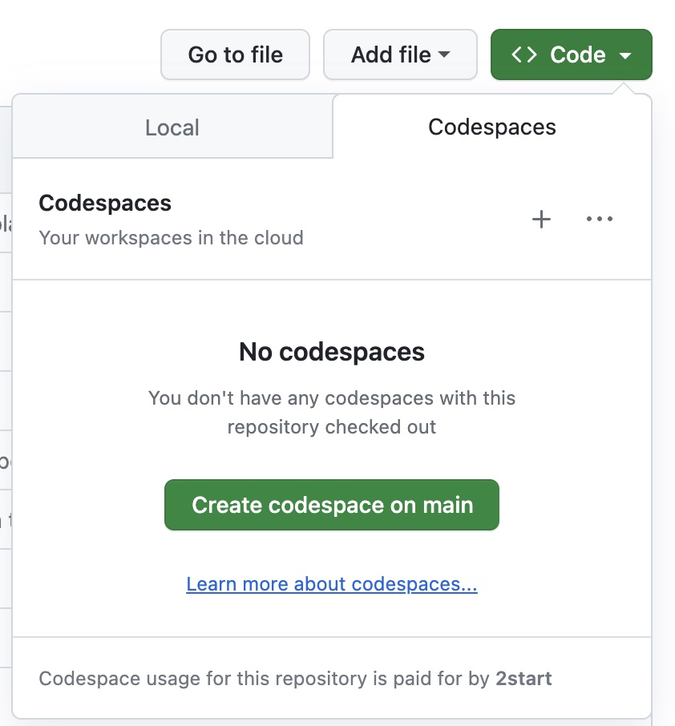
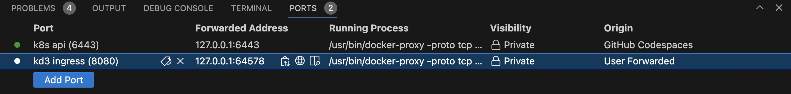
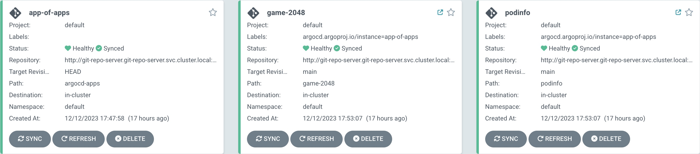

# TODO

- Rework Tasks: Introduce pattern to specify tasks and always tell the user what he is expected to see or how to verify it worked.
- Restructure app-of-apps into it's own folder. Then it's easier to understand that it belongs together with the kustomization.yaml

# Kutespace: Argo CD

Spin up a fully preconfigured learning environment with Kubernetes & Argo CD. Start the first excercise now.

## Setup

Start a new Codespace directly from Github. Please start the Codespace in a local VSCode instance. In-browser execution is not supported yet.



## Tasks

### 1. Verify the Kubernetes Setup


First check if you can interact with Kubernetes by requesting the nodes. A single node should be returned.

```
➜ /workspaces/argocd $ kubectl get nodes
NAME                       STATUS   ROLES                  AGE   VERSION
k3d-k3s-default-server-0   Ready    control-plane,master   15h   v1.27.4+k3s1
```

Next, request the pods from all namespaces. Some services are preinstalled such as Argo CD, a local git server and a traefik load balancer that allows the cluster to receive external traffic. Verify that the status is either *Completed* or *Running*.


```
➜ /workspaces/argocd $ kubectl get pods --all-namespaces
NAMESPACE         NAME                                                READY   STATUS      RESTARTS        AGE
argocd            helm-install-argocd-td8gg                           0/1     Completed   0               15h
kube-system       helm-install-traefik-m4jft                          0/1     Completed   1               15h
kube-system       helm-install-traefik-crd-cxchz                      0/1     Completed   0               15h
argocd            argocd-redis-78bfdffbd-8c9qk                        1/1     Running     2 (7m55s ago)   15h
argocd            argocd-applicationset-controller-66d5b45845-9kzt2   1/1     Running     2 (7m55s ago)   15h
kube-system       svclb-traefik-7229c3bb-2fdxl                        2/2     Running     4 (7m55s ago)   15h
game-2048         game-2048-7d46b7bfd4-sqr8g                          1/1     Running     2 (7m55s ago)   15h
git-repo-server   git-repo-server-5749c9b867-cd2ln                    1/1     Running     2 (7m55s ago)   15h
podinfo           podinfo-7df77bc677-759w5                            1/1     Running     2 (7m55s ago)   15h
kube-system       traefik-64f55bb67d-dhskf                            1/1     Running     2 (7m55s ago)   15h
argocd            argocd-server-6c9668f5f4-2bhgj                      1/1     Running     2 (7m56s ago)   15h
argocd            argocd-application-controller-0                     1/1     Running     2 (7m55s ago)   15h
argocd            argocd-repo-server-d8bfccddd-hvps7                  1/1     Running     2 (7m55s ago)   15h
kube-system       metrics-server-648b5df564-zlpc6                     1/1     Running     2 (7m55s ago)   15h
kube-system       coredns-77ccd57875-h4glh                            1/1     Running     2 (7m55s ago)   15h
kube-system       local-path-provisioner-957fdf8bc-5j67d              1/1     Running     3 (7m20s ago)   15h
```

### 2. Checkout the Argo CD Dashboard

Next, open your browser and navigate to the Argo CD dashboard at `http://argocd.127.0.0.1.nip.io:<FORWARDED K3D INGRESS PORT>`. Inside this codespace, the load balancer for our Kubernetes cluster listens to traffic on port 8080. This port is automatically forwarded to your local machine. You can find the corresponding port of you local machine in the `PORTS` section of VS Code. In the picture below we would use port 64578.



You should see the Argo CD Dashboard login page. Login using the user password combination `admin:admin`.

You should see the following screen:


In case of syncing issues, try to refresh the app-of-apps app.

### Checkout Podinfo Service
We already deployed 2 services to your cluster game-2048 and podinfo. Check out podinfo first by navigating to podinfo.127.0.0.1.nip.io:<FORWARDED K3D INGRESS PORT>.

Next, we want to try out the GitOps workflow. The folder `./manifests` contains a git repository that is connected to a git server in your Kubernetes cluster. More details about that connection follow later.

0. Notice that the podinfo app in your browser has a jade green background.
1. Check out `manifests/podinfo/resources/deployment.yaml`
2. Modify the env variable `PODINFO_UI_COLOR` and change the color. The hex code for gold is #FFD700.
3. add, commit and push your changes. Make sure you are located inside the nested git repository `./manifests` when you perform these steps.
4. Execute `watch kubectl get pods -n podinfo` to see how a rolling update is performed by starting a new pod and then terminating the old pod.
5. Wait for up to 3 minutes or refresh the app podinfo inside the Argo CD dashboard in your browser to trigger the Argo CD sync of the changes into your cluster.
6. Notice how the background of the podinfo app turned yellow: 

7. (Optional) Try out to change the displayed message by setting the env variable: PODINFO_UI_MESSAGE.

### GitOps End2End Workflow
The repository is linked to Argo CD already. I.e. any changes you push to the local git server will be synced to your cluster automatically.


The app of apps pattern is a common pattern to
- checkout app of apps
manifests/app-of-apps.yaml

### Check out game 2048
- checkout game-2048
    - game-2048.127.0.0.1.nip.io:<FORWARDED K3D INGRESS PORT>
    - manifests/game-2048


### Deploy own application
deploy this simple kanban board on your own. Check it out in the browser afterwards.
https://docs.kanboard.org/v1/admin/docker/
default user password is admin:admin

don't forget to add the argocd application manifest to the app-of-apps.
this will make the app of apps sync it too

### Present repo structure for real world projects
TODO

## Troubleshooting

You are facing issues? Let us know to help the next person facing the same issue.

argocd.127.0.0.1 dns can not be resolved. Some dns servers don't resolve DNS entries that point to localhost or 127.0.0.1. Change to something like 8.8.8.8 (google) or 1.1.1.1 (cloudflare)
